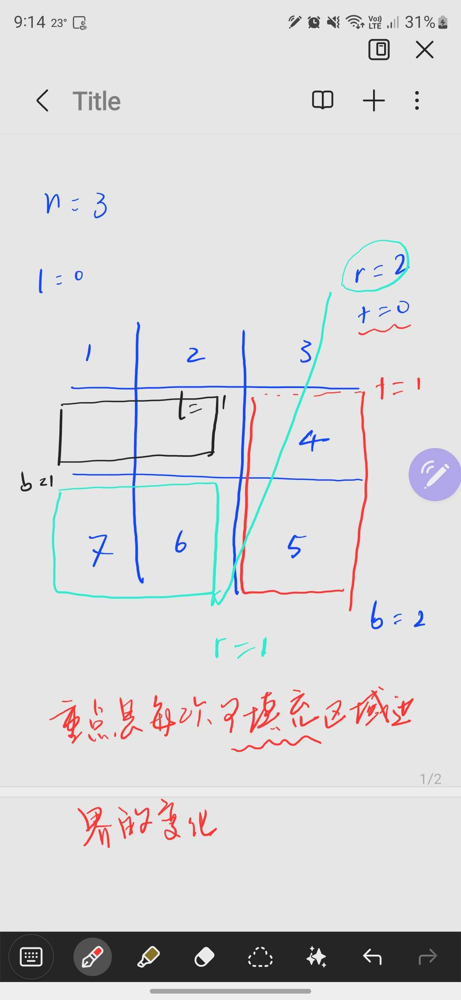

# Sliding window

## Two types

1. Fixed size window
2. Dynamic size window

### 209. Minimum Size Subarray Sum

```python
import sys

class Solution:
    def minSubArrayLen(self, target: int, nums: List[int]) -> int:
        # Edge case: if the array is empty
        if not nums:
            return 0

        # Initialize variables
        left = 0
        cur_sum = 0
        min_len = sys.maxsize

        # Iterate through the array (moving the right pointer)
        for right in range(len(nums)):
            # Add the current element to our running sum
            cur_sum += nums[right]

            # While our sum is greater than or equal to the target,
            # try to minimize the window by moving the left pointer
            while cur_sum >= target:
                # Update the minimum length
                min_len = min(min_len, right - left + 1)

                # Remove the leftmost element from the sum
                cur_sum -= nums[left]

                # Move the left pointer to the right
                left += 1

        # If we never found a valid subarray, return 0
        return min_len if min_len != sys.maxsize else 0
```

#### Key points

1. break donw the conditions
   1. if current sum >= s, update min_len and move left pointer
   2. if current sum < s, move right pointer
2. `while cur_sum >= target` use `while` instead of `if` because we need to keep moving left pointer until the condition is not satisfied

# Matrix simulation 

## Key
- define the boundary 
- understand the move of 'pointers' in 4 directions and how the boundary interacts with the pointers : the fileds waiting for filling shrink 
  - TODO: the change of boundary flat (left,right,top,bottom) happens when a for loop finishes (outside the loop, NOT inside)



### Mistakes
1. boundary 
2. we move `i` to fill in the fileds instaed of the 4 boundary flags 
3. the boudnaries of the for loop shall be defined by the 4 markers 

```python
# Mistake answer
class Solution:
    def generateMatrix(self, n: int) -> List[List[int]]:
        left, right = 0, n-1
        top, bottom = 0, n-1
        res = [[0]*n for _ in range(n)]
        n = 0

        while left <= right and top <= bottom:
            for i in range(right + 1):
                res[left][right+i] += n
                # top += 1
            top += 1
            
            for i in range(bottom + 1):
                res[top+i][right] += n
                # top += 1
            right -= 1

            # if left <= right:
            if top <= bottom:
                for i in range(right + 1):
                    res[bottom][right - i] += n
                bottom -= 1

            if left<= right:
                for i in range(right + 1):
                    res[bottom][left+1] += n
                
                left += 1
        return res 

```

```python
#correct code
class Solution:
    def generateMatrix(self, n: int) -> List[List[int]]:
        left, right = 0, n-1
        top, bottom = 0, n-1
        res = [[0]*n for _ in range(n)]
        num = 1  # Use a different variable name for counter
        
        while left <= right and top <= bottom:
            # Fill top row (left to right)
            for i in range(left, right + 1):  # Range should be from left to right
                res[top][i] = num  # Direct assignment
                num += 1           # Increment counter
            top += 1
            
            # Fill right column (top to bottom)
            for i in range(top, bottom + 1):  # Range should be from top to bottom
                res[i][right] = num
                num += 1
            right -= 1
            
            # Fill bottom row (right to left)
            if top <= bottom:
                for i in range(right, left - 1, -1):  # Range should go backward
                    res[bottom][i] = num
                    num += 1
                bottom -= 1
            
            # Fill left column (bottom to top)
            if left <= right:
                for i in range(bottom, top - 1, -1):  # Range should go backward
                    res[i][left] = num
                    num += 1
                left += 1
                
        return res
```

# [([区间和](https://www.programmercarl.com/kamacoder/0058.%E5%8C%BA%E9%97%B4%E5%92%8C.html#%E6%80%9D%E8%B7%AF))] 

题目描述

给定一个整数数组 Array，请计算该数组在每个指定区间内元素的总和。

输入描述

第一行输入为整数数组 Array 的长度 n，接下来 n 行，每行一个整数，表示数组的元素。随后的输入为需要计算总和的区间，直至文件结束。

输出描述

输出每个指定区间内元素的总和。

输入示例
```
5
1
2
3
4
5
0 1
1 3
```
输出示例
```
3
9
```
数据范围：
```
0 < n <= 100000
```

1. **预处理前缀和数组**：
   - 创建一个长度比原数组大1的前缀和数组`preSum`，其中`preSum[i]`表示原数组前`i`个元素的和。
   - 例如，原数组`[1,2,3,4,5]`对应的前缀和数组为`[0,1,3,6,10,15]`。

2. **快速计算区间和**：
   - 对于每个查询区间`[a, b]`，其和等于`preSum[b+1] - preSum[a]`。这利用了前缀和数组的差值特性，将区间和的计算复杂度从O(n)降至O(1)。

**代码实现**：
```python
def main():
    import sys
    input = sys.stdin.read().split()
    ptr = 0
    n = int(input[ptr])
    ptr += 1
    array = []
    for _ in range(n):
        array.append(int(input[ptr]))
        ptr += 1
    # 构建前缀和数组
    preSum = [0] * (n + 1)
    for i in range(1, n+1):
        preSum[i] = preSum[i-1] + array[i-1]
    # 处理查询
    while ptr < len(input):
        a = int(input[ptr])
        b = int(input[ptr+1])
        ptr +=2
        res = preSum[b+1] - preSum[a]
        print(res)
        
if __name__ == "__main__":
    main()
```

**关键点解释**：
- **前缀和数组**：通过预处理将前i项和存储起来，避免重复计算。
- **查询优化**：每次查询只需两次数组访问和一次减法操作，极大提升效率。
- **输入处理**：使用`sys.stdin.read`一次性读取所有输入，避免逐行读取的性能问题。

这种方法的时间复杂度为O(n + q)，其中n是数组长度，q是查询次数，能够高效处理大规模数据。

# [[开发商购买土地](https://www.programmercarl.com/kamacoder/0044.%E5%BC%80%E5%8F%91%E5%95%86%E8%B4%AD%E4%B9%B0%E5%9C%9F%E5%9C%B0.html#%E6%80%9D%E8%B7%AF)]

这个问题的核心在于如何高效地找到划分两个子区域的最小价值差。我们可以通过前缀和技巧来优化计算，避免重复求和。以下是详细的解题思路：

---

### **解题思路**
1. **预处理行列总和**：
   - 计算每一行的总和 `row_sum` 和每一列的总和 `col_sum`。
   - 构建行前缀和数组 `prefix_row` 和列前缀和数组 `prefix_col`，用于快速计算任意前若干行或列的总和。

2. **计算总价值**：
   - 整个区域的总价值 `total` 可以通过前缀和数组的最后一个元素直接得到。

3. **遍历所有可能的划分方式**：
   - **横向划分**：枚举每一行后的分割线，计算上下两个区域的总价值差。
   - **纵向划分**：枚举每一列后的分割线，计算左右两个区域的总价值差。
   - 每次划分的差值公式为 `abs(total - 2 * sum_part)`，其中 `sum_part` 是某一部分的总和。

4. **取最小值**：
   - 在所有可能的横向和纵向划分中，找到最小的差值。

---

### **代码实现**
```python
import sys

def main():
    data = list(map(int, sys.stdin.read().split()))
    ptr = 0
    n = data[ptr]
    ptr += 1
    m = data[ptr]
    ptr += 1
    
    grid = []
    for _ in range(n):
        row = data[ptr:ptr+m]
        ptr += m
        grid.append(row)
    
    # 计算每行和每列的总和
    row_sum = [sum(row) for row in grid]
    col_sum = [sum(grid[i][j] for j in range(m) for i in range(n)]  # 这样得到的是按列展开的顺序，需要调整
    # 修正列总和的计算方式
    col_sum = []
    for j in range(m):
        col_total = 0
        for i in range(n):
            col_total += grid[i][j]
        col_sum.append(col_total)
    
    # 计算行和列的前缀和
    prefix_row = [0] * (n + 1)
    for i in range(1, n+1):
        prefix_row[i] = prefix_row[i-1] + row_sum[i-1]
    
    prefix_col = [0] * (m + 1)
    for j in range(1, m+1):
        prefix_col[j] = prefix_col[j-1] + col_sum[j-1]
    
    total = prefix_row[n]
    min_diff = float('inf')
    
    # 横向划分：分割线在第i行后（0 <= i < n-1）
    for i in range(n-1):
        sum_up = prefix_row[i+1]
        diff = abs(total - 2 * sum_up)
        if diff < min_diff:
            min_diff = diff
    
    # 纵向划分：分割线在第j列后（0 <= j < m-1）
    for j in range(m-1):
        sum_left = prefix_col[j+1]
        diff = abs(total - 2 * sum_left)
        if diff < min_diff:
            min_diff = diff
    
    print(min_diff)

if __name__ == "__main__":
    main()
```

---

### **关键点解释**
1. **前缀和数组**：
   - `prefix_row[i]` 表示前 `i` 行的总和，`prefix_col[j]` 表示前 `j` 列的总和。
   - 通过前缀和，可以在常数时间内得到任意前若干行或列的总和。

2. **差值计算**：
   - 总价值为 `total`，若某部分总和为 `sum_part`，则差值为 `abs(total - 2 * sum_part)`。这是因为两部分的差值等于 `|sum_part - (total - sum_part)|`。

3. **时间复杂度**：
   - 预处理行列总和的时间复杂度为 O(nm)。
   - 遍历横向和纵向划分的时间复杂度为 O(n + m)。
   - 总时间复杂度为 O(nm)，适用于题目给定的数据范围（n, m ≤ 100）。